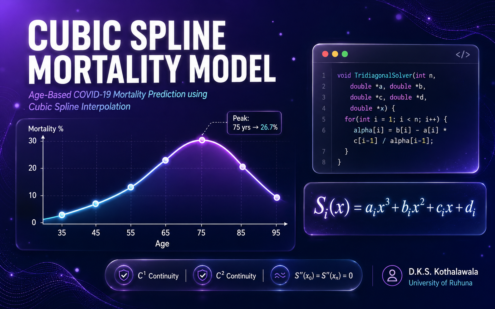

<div align="center">



<br/>


&nbsp;

&nbsp;


</div>

---

## 👤 About This Project

| | |
|:---|:---|
| **Author** | D.K.S. Kothalawala &nbsp;`SC/2022/12764` |
| **Supervisor** | Dr. E.J.K.P. Nandani |
| **Institution** | Department of Mathematics, University of Ruhuna, Matara |
| **Course Unit** | Mathematical Computing — BSc Mathematics |
| **Year** | 2024 |

---

## 🔍 What This Project Does

COVID-19 mortality is strongly correlated with age. This project builds a **natural cubic spline** across 7 age-group data points to produce a smooth, continuous curve that models how mortality percentage changes with age — capturing the non-linear relationship that simpler models miss.

The C program:
- Accepts age and mortality data as input
- Constructs piecewise cubic polynomials between each age interval
- Enforces continuity of first and second derivatives across all intervals
- Applies **natural boundary conditions** &nbsp;`M[0] = 0` &nbsp;and&nbsp; `M[n-1] = 0`
- Outputs spline equations in both original and standard polynomial form
- Generates a `.dat` file for curve plotting

---

## 📊 Data

> Source: Sri Lanka Ministry of Health

| Age Group | Mean Age | Death % |
|:---------:|:--------:|:-------:|
| 31 – 40 | 35 | 2.4 |
| 41 – 50 | 45 | 12.4 |
| 51 – 60 | 55 | 16.7 |
| 61 – 70 | 65 | 21.4 |
| **71 – 80** | **75** | **26.7** |
| 81 – 90 | 85 | 15.7 |
| 91 – 100 | 95 | 2.4 |

> **Key Finding — Mortality peaks in the 71–80 age group (26.7%)** and drops sharply at both ends, producing a bell-shaped spline curve across the age range 35–95.

---

## ⚙️ How It Works

```
Input data points (x, y)
        │
        ▼
Compute interval widths h[i]
        │
        ▼
Build tridiagonal system for second derivatives M[i]
        │
        ▼
Solve using TridiagonalEquationsSolver()
        │
        ▼
Apply natural boundary conditions  →  M[0] = 0,  M[n-1] = 0
        │
        ▼
Output spline equations  +  write cubic_spline_plot.dat
        │
        ▼
Evaluate mortality at any given age x
```

---

## 🗂️ Repository Structure

```
├── README.md
├── assets/
│   └── banner.png
├── src/
│   └── main.c
└── documentation/
    └── report.pdf
```

---

## 🚀 Getting Started

### Prerequisites

Any C compiler — GCC recommended.

### Compile

```bash
gcc src/main.c -o cubic_spline
```

### Run

```bash
./cubic_spline
```

### Sample Input

```
Enter number of data points: 7
Enter x1 and y1: 35 2.4
Enter x2 and y2: 45 12.4
Enter x3 and y3: 55 16.7
Enter x4 and y4: 65 21.4
Enter x5 and y5: 75 26.7
Enter x6 and y6: 85 15.7
Enter x7 and y7: 95 2.4
```

### Sample Output

```
S0(x) = -0.0015 * x^3 + 0.1537 * x^2 + -4.2332 * x + 25.0389
S1(x) =  0.0016 * x^3 + -0.2625 * x^2 + 14.4964 * x + -255.9064
S2(x) =  0.0011 * x^3 + -0.1747 * x^2 + 9.6658  * x + -167.3438
S3(x) = -0.0058 * x^3 + 1.1618  * x^2 + -77.2068 * x + 1714.8938
S4(x) =  0.0051 * x^3 + -1.2789 * x^2 + 105.8481 * x + -2861.4764
S5(x) = -0.0006 * x^3 + 0.1585  * x^2 + -16.3323 * x + 600.2989

Data points have been written to 'cubic_spline_plot.dat'.
```

### Visualise the Curve

Plot the output using gnuplot:

```bash
gnuplot -e "plot 'cubic_spline_plot.dat' with lines; pause -1"
```

---

## 📄 Full Report

For the complete mathematical derivation, methodology, literature review, and discussion:

📖 &nbsp;[**Read the Full Report →**](./documentation/report.pdf)

---

## 📚 References

1. Arambepola et al. — *Sri Lanka's early success in the containment of COVID-19 through its rapid response*, PLoS One, 2021
2. Mulchandani et al. — *Factors associated with differential COVID-19 mortality rates in the SEAR nations*, IJID Regions, 2022
3. Weerasinghe et al. — *Measures of mortality in COVID-19: beyond the death toll*, Journal of the College of Community Physicians of Sri Lanka, 2020
